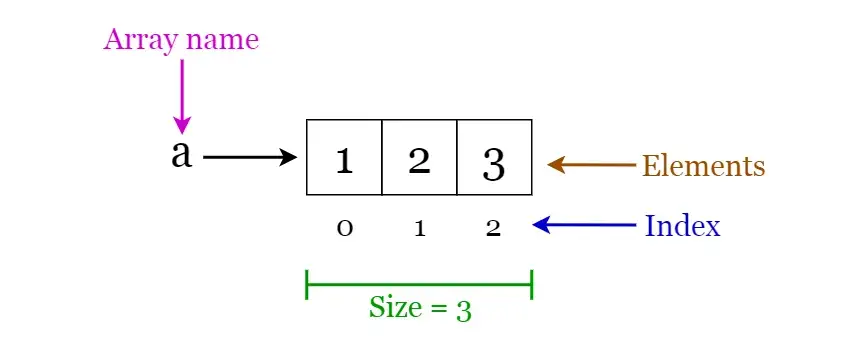

# **Arrays**
An **array** is a structure of *contiguous* fixed-size memory, which can hold items of the same data type. This makes it easier to calculate the position of each element by simply adding an offset to a base value, i.e., the memory location of the first element of the array (generally denoted by the name of the array). It can be an array of integers, an array of floating-point numbers, an array of strings or even an array of arrays (such as *2-dimensional arrays*). *Arrays are indexed*, meaning that random access is possible.

#### **Array operations:**
- **Traverse:** Go through the elements and print them.
- **Search:** Search for an element in the array. You can search the element by its value or its index
- **Update:** Update the value of an existing element at a given index

**Inserting** elements to an array and **deleting** elements from an array cannot be done straight away as arrays are fixed in size. If you want to insert an element to an array, first you will have to create a new array with increased size (current size + 1), copy the existing elements and add the new element. The same goes for the deletion with a new array of reduced size.

#### **Advantages of an Array in C/C++:** 

1. Random access of elements using the array index.
2. Use of fewer lines of code as it creates a single array of multiple elements.
3. Easy access to all the elements.
4. Traversal through the array becomes easy using a single loop.
5. Sorting becomes easy as it can be accomplished by writing fewer lines of code.

#### **Disadvantages of an Array in C/C++:** 

1. Allows a fixed number of elements to be entered which is decided at the time of declaration. Unlike a linked list, an array in C is not dynamic.
2. Insertion and deletion of elements can be costly since the elements are needed to be managed in accordance with the new memory allocation.

#### **Applications of arrays:**
- Used as the building blocks to build other data structures such as array lists, heaps, hash tables, vectors and matrices.
- Used for different sorting algorithms such as insertion sort, quick sort, bubble sort and merge sort.
