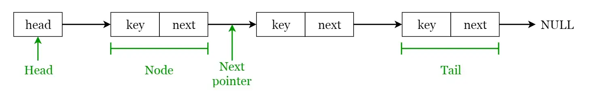

# **Linked Lists**
A **linked list** is a sequential structure that consists of a sequence of items in linear order which are linked to each other. Hence, you have to access data sequentially and random access is not possible. Linked lists provide a simple and flexible representation of dynamic sets. In simple words, a linked list consists of nodes where each node contains a data field and a reference(link) to the next node in the list.

Let’s consider the following terms regarding linked lists. You can get a clear idea by referring to image below.

- Elements in a linked list are known as **nodes**.
- Each node contains a **key** and a pointer to its successor node, known as **next**.
- The attribute named **head** points to the first element of the linked list.
- The last element of the linked list is known as the **tail**.

#### **Advantages of Linked Lists:**
- Dynamic size 
- Ease of insertion/deletion 

#### **Drawbacks of Linked Lists:** 
- Random access is not allowed. We have to access elements sequentially starting from the first node(head node). So we cannot do a binary search with linked lists efficiently with its default implementation. 
- Extra memory space for a pointer is required with each element of the list. 
- Not cache-friendly. Since array elements are contiguous locations, there is the locality of reference which is not there in the case of linked lists.
- It takes a lot of time in traversing and changing the pointers.
- Reverse traversing is not possible in singly linked lists.s
- It will be confusing when we work with pointers.
- Direct access to an element is not possible in a linked list as in an array by index.
- Searching for an element is costly and requires O(n) time complexity.
- Sorting of linked lists is very complex and costly.

#### **Types of Linked Lists:**

- **Singly linked list** — Traversal of items can be done in the forward direction only.
- **Doubly linked list** — Traversal of items can be done in both forward and backward directions. Nodes consist of an additional pointer known as **prev**, pointing to the previous node.
- **Circular linked lists** — Linked lists where the prev pointer of the head points to the tail and the next pointer of the tail points to the head.
- **Doubly circular linked list** – A Doubly Circular linked list or a circular two-way linked list is a more complex type of linked list that contains a pointer to the next as well as the previous node in the sequence. The difference between the doubly linked and circular doubly list is the same as that between a singly linked list and a circular linked list. The circular doubly linked list does not contain null in the previous field of the first node.
- **Header linked list** – A header linked list is a special type of linked list that contains a header node at the beginning of the list. 

#### **Linked list operations:**
- **Insert:** Insert a key to the linked list. An insertion can be done in 3 different ways; insert at the beginning of the list, insert at the end of the list and insert in the middle of the list.
- **Delete:** Removes an element x from a given linked list. You cannot delete a node by a single step. A deletion can be done in 3 different ways; delete from the beginning of the list, delete from the end of the list and delete from the middle of the list.
- **Search:** Find the first element with the key k in the given linked list by a simple linear search and returns a pointer to this element

#### **Applications of linked lists:**
- Used for *symbol table management* in compiler design.
- Used in switching between programs using Alt + Tab (implemented using Circular Linked List).
