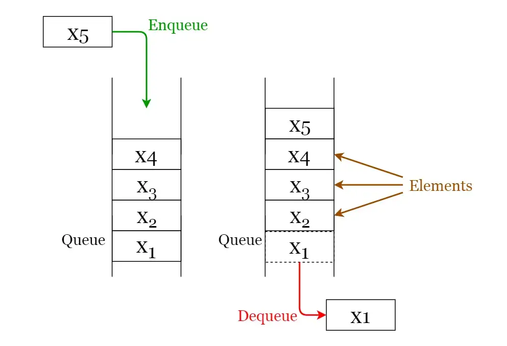

# **Queues**
A **queue** is a **FIFO** (*First In First Out* — the element placed at first can be accessed at first) structure which can be commonly found in many programming languages. This structure is named as “queue” because it resembles a real-world queue — people waiting in a queue.

#### **Queue operations:**
A queue is an object (an abstract data structure - ADT) that allows the following operations: 

- **Enqueue:** Insert an element to the end of the queue.
- **Dequeue:** Delete the element from the beginning of the queue.
- **Front:** Get the value of the front of the queue without removing it.
- **Rear:** Get the value of the rear end of the queue without removing it.
- **IsEmpty:** Check if the queue is empty.
- **IsFull:** Check if the queue is full.
- **Size:** Returns the size of the queue i.e. the total number of elements it contains.

Please refer to image below  to get a better understanding of the queue operations.

#### **Types of Queues:**

- **Simple Queue:** Simple queue also known as a linear queue is the most basic version of a queue. Here, insertion of an element i.e. the Enqueue operation takes place at the rear end and removal of an element i.e. the Dequeue operation takes place at the front end. Here problem is that if we pop some item from front and then rear reach to the capacity of the queue and although there are empty spaces before front means the stack is not full but as per condition in isFull() function, it will show that the stack is full then. To solve this problem we use circular queue.
- **Circular Queue:** In a circular queue, the element of the queue act as a circular ring. The working of a circular queue is similar to the linear queue except for the fact that the last element is connected to the first element. Its advantage is that the memory is utilized in a better way. This is because if there is an empty space i.e. if no element is present at a certain position in the queue, then an element can be easily added at that position using modulo capacity(%n).
- **Priority Queue:** This queue is a special type of queue. Its specialty is that it arranges the elements in a queue based on some priority. The priority can be something where the element with the highest value has the priority so it creates a queue with decreasing order of values. The priority can also be such that the element with the lowest value gets the highest priority so in turn it creates a queue with increasing order of values. In pre-define priority queue, C++ gives priority to highest value whereas Java gives priority to lowest value.
- **Double Ended Queue:**  As the name suggests double ended, it means that an element can be inserted or removed from both ends of the queue, unlike the other queues in which it can be done only from one end. Because of this property, it may not obey the First In First Out property. 

#### **Applications of queues:**
- Used to manage threads in multithreading.
- Used to implement queuing systems (e.g.: priority queues).
- When data is transferred asynchronously (data not necessarily received at same rate as sent) between two processes. Examples include IO Buffers, pipes, file IO, etc.
