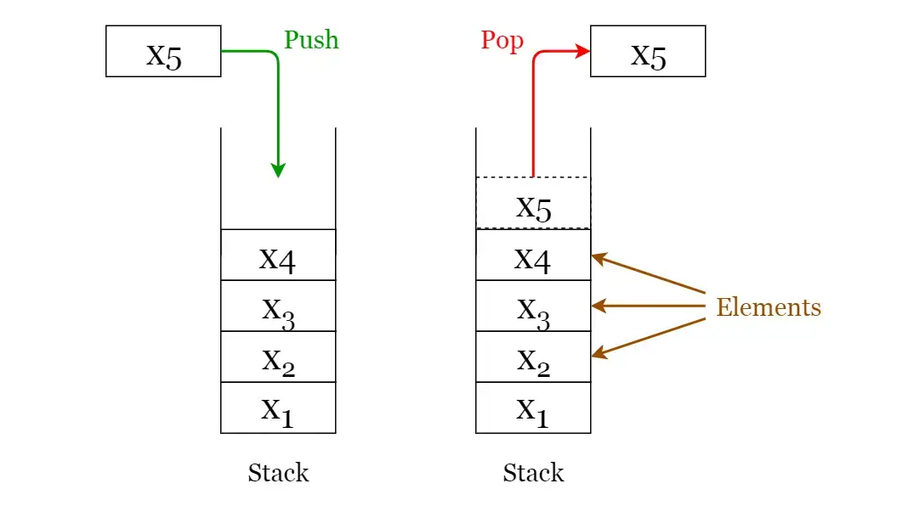

# **Stacks**
A **stack** is a **LIFO** (*Last In First Out* — the element placed at last can be accessed at first) structure which can be commonly found in many programming languages. This structure is named as “stack” because it resembles a real-world stack — a stack of plates.

#### **Stack operations:**
Given below are the 2 basic operations that can be performed on a stack. Please refer to image below to get a better understanding of the stack operations.

- **Push:**  Insert an element on to the top of the stack.
- **Pop:** Delete the most top element and return it.

Furthermore, the following additional functions are provided for a stack in order to check its status.

- **Peek:** Return the top element of the stack without deleting it.
- **isEmpty:** Check if the stack is empty.
- **size:** Return the size of stack.
- **isFull:** Check if the stack is full.

#### **Types of stacks:**
- **Register Stack:** This type of stack is also a memory element present in the memory unit and can handle a small amount of data only. The height of the register stack is always limited as the size of the register stack is very small compared to the memory.
- **Memory Stack:** This type of stack can handle a large amount of memory data. The height of the memory stack is flexible as it occupies a large amount of memory data. 

#### **Applications of stacks:**
- Used for expression evaluation (e.g.: shunting-yard algorithm for parsing and evaluating mathematical expressions).
- Used to implement function calls in recursion programming.
